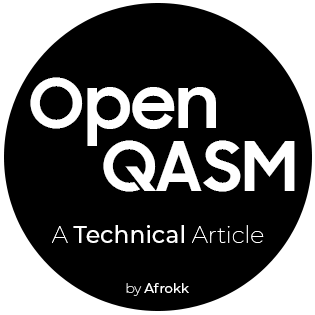

 

  

  <h3 align="center">Open Quantum Assembly Language: A Technical Article</h3>

  

    My technical article on the Open Quantum Assembly Language. 
     
    <a href="https://github.com/Afrokk/OpenQASM-Technical-Article/blob/main/Report.pdf" target="_blank"><strong>Check it out Live! »</strong></a>
     
  

## About The Project

My technical article on the Open Quantum Assembly Language. 

## Built With

Built with Overleaf & LaTeX.

* [![LaTex][LaTex.com]][LaTex-url]
* [![Overleaf][Overleaf.com]][Overleaf-url]

## Contact

Afrasiyab (Afrokk) Khan - [@afrokk_](https://www.instagram.com/afrokk_/) - [afrokk.design](https://afrokk.design/home) - [LinkedIn](https://www.linkedin.com/in/afrasiyab-k/) - afrasiyabkhan379@gmail.com

Project Link: [https://github.com/Afrokk/Vintage-Autohaus](https://github.com/Afrokk/Vintage-Autohaus)

[LaTex.com]: https://img.shields.io/badge/LaTeX-47A141?style=for-the-badge&logo=LaTeX&logoColor=white
[LaTex-url]: https://developer.mozilla.org/en-US/docs/Web/CSS
[Overleaf.com]: https://img.shields.io/badge/Overleaf-47A141?style=for-the-badge&logo=Overleaf&logoColor=white
[Overleaf-url]: www.overleaf.com
